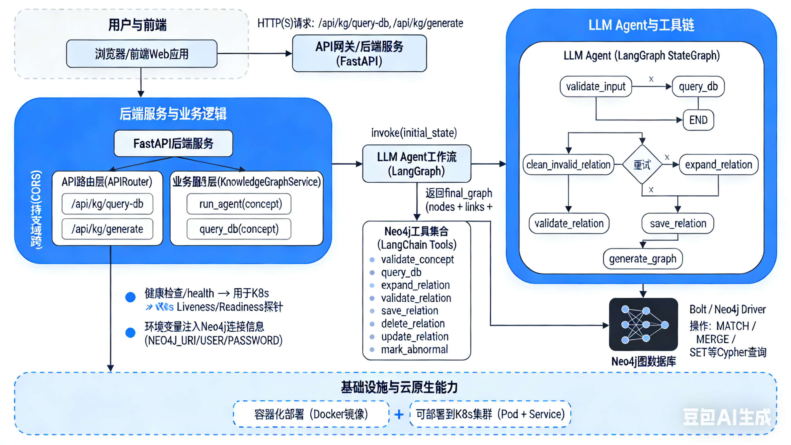

## 分工介绍
阮翰文：负责后端架构以及llm agent的设计与实现（50%）
柳元杰：负责前端界面的实现（50%）
评分方式：组内均分
## 架构设计

### 整体架构概述

本系统是一个“跨学科知识图谱智能体”应用，整体采用前后端分离 + 图数据库 + LLM Agent 的架构，核心流程如下：

- **前端 Web 客户端**  
  负责用户交互，输入“核心概念”，发起两类请求：
  - 仅查库：`POST /api/kg/query-db`  
  - 智能体生成图谱：`POST /api/kg/generate`  

- **后端服务（FastAPI）**  
  使用 FastAPI 构建 RESTful API，主要职责：  
  - 提供知识图谱查询与生成的 HTTP 接口  
  - 进行基础参数校验、异常处理和统一返回格式  
  - 对外暴露健康检查接口 `/health`，用于云原生环境的探活与监控  

- **知识图谱服务层（KnowledgeGraphService）**  
  - 封装对 LangGraph Agent 的调用，负责发起完整的“输入校验 → 查库 → 扩展 → 校验 → 存库 → 生成图谱”流程  
  - 提供 `query_db` 接口直接使用 Neo4j Driver 查询已有的合法关系，用于“只看已有知识图谱”的场景  

- **LLM Agent 层（LangGraph + LangChain）**  
  - 使用 LangGraph 的 `StateGraph` 构建有状态智能体工作流，将整个图谱构建过程拆分为一系列节点（输入校验、查库、清理旧关联、扩展新关联、校验新关联、存库、生成最终图谱等）  
  - 基于 LangChain 的 `tool` 机制，将访问 Neo4j 的一组工具（查询、扩展、存储、标记异常等）暴露给 Agent 调用  
  - 使用 LangChain 的 `ChatOpenAI` + `ChatPromptTemplate` 与 LLM（通过 SiliconFlow 接入 DeepSeek 模型）交互  

- **图数据库层（Neo4j）**  
  - 用于持久化存储“概念节点”和“概念间关系”，支持属性、版本号、强度、时间戳等  
  - 提供关系查询、MERGE 去重、软删除和异常标记等操作。  

### 系统架构图

### 云原生组件与部署方式


- **容器化（Docker）**  
  - 后端 FastAPI 服务可封装为 Docker 镜像，镜像内包含：  
    - 应用代码（`backend/app`）  
    - Python 依赖（FastAPI、Uvicorn、neo4j-driver、LangChain、LangGraph 等）  
  - 打包后镜像可部署到任意支持容器的环境（本地、云上 K8s 集群等）。

- **图数据库（Neo4j）**  
  - 通过官方 `neo4j` Python Driver 连接，连接信息以环境变量形式配置，便于在不同环境（开发/测试/生产）下切换。  
  - 使用 `init_neo4j` 函数增加重试逻辑，适配容器编排场景下“应用先启动、数据库稍后就绪”的情况，提高整体弹性。  

- **健康检查与可观测性**  
  - 在 `main.py` 中实现了 `/health` 接口，启动时初始化 Neo4j Driver，并在健康检查时调用 `driver.verify_connectivity()`：  
    - 方便 K8s 使用 Liveness/Readiness 探针检测服务状态  
    - 也方便云监控系统采集后端与数据库的运行状况  


### LLM Agent 工具链

系统的 LLM Agent 工具链主要由以下部分组成：

- **LLM 接入层**  
  - 使用 `langchain_openai.ChatOpenAI` 封装对 LLM 的调用：  
    - `base_url = "https://api.siliconflow.cn/v1"`  
    - 模型：`deepseek-ai/DeepSeek-V3.2-Exp`  
    - 通过 `get_llm()` 统一创建 LLM 实例，用于所有工具和 Agent 节点。  

- **Prompt 构建与链式调用**  
  - 使用 `langchain_core.prompts.ChatPromptTemplate` 定义结构化 Prompt 模板；  
  - 通过 `prompt | llm` 组合为 Chain，统一执行 `chain.invoke(...)` 获取模型输出；  
  - 要求模型**严格返回 JSON 字符串**（或 JSON 数组），便于后续程序解析与逻辑处理。  

- **工具层（LangChain Tools）**  
  - 通过 `@tool` 装饰器对访问 Neo4j 和调用 LLM 的函数进行封装，形成可被 Agent 调度的一组工具：  
    - `validate_concept`：概念有效性校验  
    - `query_db`：Neo4j 查库  
    - `expand_relation`：跨学科关系扩展  
    - `validate_relation`：新关系逻辑校验（防幻觉）  
    - `save_relation` / `delete_relation` / `update_relation` / `mark_abnormal`：关系维护与版本管理  

- **Agent 工作流（LangGraph StateGraph）**  
  - 使用 `StateGraph(GraphState)` 明确系统状态结构，包括：`concept`、`db_result`、`new_relations`、`valid_relations`、`cleaned_relations`、`final_graph`、`reasoning` 等；  
  - 将工具调用按业务语义拆分为多个节点（validate_input, query_db, expand_relation, validate_relation, save_relation, generate_graph），组合成有条件分支的图结构；  
  - 最终返回一个结构化的 `final_graph`，完全符合前端期望的格式（节点列表 + 边列表 + 推理过程）。

---

## 智能体策略

### 关键 Prompt 模板

系统中与智能体行为最相关的关键 Prompt 主要包括三类：概念校验、关联扩展、关联校验。下面用接近自然语言的形式概括（可作为报告展示使用）。

#### 1. 概念有效性校验 Prompt（工具：`validate_concept`）

- **角色定位**：  
  - “你是知识图谱概念有效性校验专家”。

- **核心规则**：  
  - 有效概念：具体、有科学/学科意义的概念（如“熵”、“神经网络”、“最小二乘法”）。  
  - 无效概念：无意义词汇、过于宽泛、非学科概念（如“随便”、“科学”、“吃饭”）。  
  - 仅基于语义理解判断，禁止仅做字面匹配。  
  - 不确定时偏保守：返回 `valid: false`，并给出原因。  
  - **输出格式**必须是 JSON：  
    - `{"valid": true/false, "reason": "校验理由（≤80字）"}`  
    - 不允许出现多余的自然语言说明。  

- **示例（概括版模板）**：

```text
你是知识图谱概念有效性校验专家，请基于以下规则判断概念是否有效：
1. 有效概念：具体的、有科学/学科意义的概念；
2. 无效概念：无意义词汇/过于宽泛/非学科概念；
3. 不确定则返回 valid: false；
只返回 JSON 字符串：{"valid": true/false, "reason": "具体理由"}，reason ≤ 80 字。
待判断概念：{concept}
```

#### 2. 跨学科关联扩展 Prompt（工具：`expand_relation`）

- **角色定位**：  
  - “你是跨学科关联挖掘专家”。

- **核心规则**：  
  - 输入包括：核心概念 `{concept}` 以及已有关联节点列表 `{existing_nodes}`。  
  - 需要生成 **5 个新的跨学科关联**，并满足：  
    - 来自不同学科领域：数学、物理、计算机、生物、社会学、化学、经济学等；  
    - 禁止生成已存在的节点，禁止自关联（A → A）和无意义关联；  
    - 必须有客观科学依据，禁止编造不存在的概念或关系；  
    - 关联逻辑要具体，不能泛泛而谈；  
    - 为每个关联打分 `strength`（1–5）。  
  - **输出格式**为 JSON 数组，每个元素结构：  
    - `{"name": "...","domain": "...","definition": "1 句话定义","relation": "2 句话关联逻辑","strength": 数值}`  

- **示例（概括版模板）**：

```text
你是跨学科关联挖掘专家，基于以下信息扩展新关联：
1. 核心概念：{concept}
2. 已有关联节点（避免重复）：{existing_nodes}
生成 5 个新的跨学科关联，每个来自不同领域（数学/物理/计算机/生物/社会学/化学/经济学），
禁止自关联和无意义关联，关联必须基于客观科学知识并给出具体逻辑说明。
仅返回 JSON 数组：[{"name": "...","domain": "...","definition": "...","relation": "...","strength": 1-5}]，无其他文字。
```

#### 3. 关联逻辑校验 Prompt（工具：`validate_relation`）

- **角色定位**：  
  - “你是科学知识逻辑校验专家”。

- **核心规则**：  
  - 输入包括：核心概念 `core_name`、关联概念 `rel_name`、关联逻辑文本 `relation`。  
  - 要求基于客观科学知识判断这段“关联逻辑”是否合理：  
    - 若包含编造的事实或不存在的概念 → `valid: false`；  
    - 若过于空泛（如“这两个有关系”）且缺乏具体依据 → `valid: false`；  
    - 不确定时同样要偏保守 → `valid: false`；  
  - **输出格式**固定为 JSON：  
    - `{"valid": true/false, "reason": "校验理由（≤50字）"}`  

- **示例（概括版模板）**：

```text
你是科学知识逻辑校验专家，请基于客观公开的科学知识判断以下关联是否合理：
核心概念：{core_name}
关联概念：{rel_name}
关联逻辑：{relation}
若存在编造事实/不存在的概念/逻辑过于空泛或不确定，请返回 valid: false 并说明原因。
仅返回 JSON 字符串：{"valid": true/false, "reason": "具体理由"}，无其他文字。
```

这些 Prompt 模板共同保证了：  
- 输入概念的有效性（减少垃圾输入）；  
- 生成关联的跨学科性与多样性；  
- 通过二次校验约束 LLM 幻觉，保证最终知识图谱的可信度。

### LLM Agent 设计过程

#### 1. 设计动机与目标

一开始的想法是：直接用 LLM 根据用户输入一次性生成一整张知识图谱。但在实际尝试中暴露出几个问题：

- **不可控**：一次性生成的节点和边数量难以约束，经常超出前端可视化和作业要求（最多 5 个节点）的范围。
- **不可验证**：LLM 同时“想概念 + 造关系 + 决定是否合理”，前后没有约束，难以对中间结果做质量控制。
- **难以复用**：查库、扩展、校验、存库等逻辑全部糊在一个 Prompt 里，既不利于调试，也很难和 Neo4j 形成良好的闭环。

因此系统最终采用 **Agent 工作流** 的方式：把“构建图谱”拆成多个可解释的步骤，每个步骤都可以单独调试、监控和优化，目标是：

- 在有限节点数（≤10）的前提下，尽可能生成**跨学科且有依据**的关系；
- 通过“校验 + 回写 Neo4j”的闭环，让 LLM 逐步修正和清理图谱，而不是一次性给出黑盒结果。

#### 2. 状态建模：GraphState 的设计

Agent 使用 LangGraph 的 `StateGraph(GraphState)` 来管理全局状态。`GraphState` 不是简单的字符串，而是一个结构化的字典，核心字段包括：

- `concept`：当前处理的核心概念，是整条链路的“主键”。
- `input_valid` / `input_error_msg`：输入校验的布尔结果和错误提示，决定流程是继续还是提前终止。
- `db_result`：从 Neo4j 查到的原始 JSON 结果字符串，用于后续清理旧关联、避免重复扩展。
- `new_relations` / `valid_relations` / `invalid_relations`：LLM 扩展结果及其校验情况，支撑“先生成、再筛选”的策略。
- `cleaned_relations`：对数据库中不合理旧关系（软删除/标记异常）的记录，便于最终图谱中排除这些边。
- `final_graph`：最终返回给前端的图谱结构（包含节点、边、推理过程等），是整条工作流的产出。
- `reasoning`：以列表形式记录每一步的自然语言解释，用作可观测性和作业展示的“推理链”。
- `expand_retry_count`：记录扩展阶段的重试次数，用于控制循环次数和收敛条件。

通过显式的状态建模，Agent 的每一步都可以只关注“读哪些字段、写哪些字段”，既清晰又方便日志排查。

#### 3. 节点划分与流程编排

在 `kg_graph.py` 中，Agent 将整个流程拆分为 7 个核心节点 + 2 个条件分支函数：

- `validate_input`：输入校验节点
  - 调用 `validate_concept` 工具（LLM + 规则）判断概念是否有效；
  - 若无效，则在 `final_graph` 中直接写入错误码和提示信息，并通过条件分支跳转到 `END`，提前结束流程。

- `query_db`：查库节点
  - 调用 `query_db` 工具从 Neo4j 读取该概念已有的合法关联；
  - 查询结果以 JSON 字符串形式存入 `db_result`，同时在 `reasoning` 中记录“已有多少关联”。

- `clean_invalid_relation`：清理旧关联节点
  - 遍历 `db_result` 中的旧关系，调用 `validate_relation` / `delete_relation` / `mark_abnormal` 工具；
  - 对明显不合理的边做软删除或标记异常，并将变更记录写入 `cleaned_relations`，为最终图谱做“去噪”。

- `expand_relation`：扩展新关联节点
  - 调用 `expand_relation` 工具，传入核心概念与已有关联列表，要求生成 5 条跨学科的新关系；
  - 解析 LLM 返回的 JSON 数组，得到 `new_relations`；若解析失败，则给出一个跨学科默认模板，保证流程不中断；
  - 每次调用会递增 `expand_retry_count`，并在 `reasoning` 中记录“第几次扩展、生成了多少条关联”。

- `validate_relation`：新关联校验节点
  - 对 `new_relations` 中的每条候选关系，再次调用 `validate_relation` 工具；
  - 合理的写入 `valid_relations`，存疑或不合理的写入 `invalid_relations`，并在 `reasoning` 中统计数量。

- `save_relation`：存库节点
  - 对所有 `valid_relations`，构造结构化 JSON 调用 `save_relation` 工具；
  - 使用 Neo4j 的 MERGE 去重，同时记录版本号与时间戳，形成“可回溯”的关系版本。

- `generate_graph`：最终图谱生成节点
  - 综合 `db_result` 中清理后保留的旧边 + 新增的合法边，构建 `nodes` 与 `links`；
  - 加入核心节点，并对所有节点去重；
  - **强制限制总节点数 ≤ 5**：只保留核心节点 + 最多 4 个其他节点；
  - 过滤掉指向已删除/未选中节点的边，最终生成符合前端要求格式的 `final_graph`。

此外有两个条件分支节点：

- `should_continue_process`：在输入校验后判断是进入 `query_db` 还是直接 `END`；
- `should_re_expand`：在关联校验后判断是否需要再次扩展（`expand_retry_count` 未超限且合法关联数 < 5）还是进入 `save_relation`。

#### 4. 重试与收敛策略

为了兼顾“关联数量够用”和“不会无限循环”，在扩展阶段引入了明确的重试与收敛机制：

- 初始时 `expand_retry_count = 0`，每次执行 `expand_relation` 都会 `+1`；
- 在 `should_re_expand` 中：
  - 若 `valid_relations` 数量 < 5 且 `expand_retry_count` 小于预设上限，则再次回到 `expand_relation`；
  - 否则，无论当前合法关联是否达到 5 条，统一进入 `save_relation`，保证流程可以收敛结束。

通过这个策略，Agent 在“足够多的高质量关联”和“有限调用次数/成本”之间做了平衡，避免因 LLM 偶然输出质量差而陷入死循环。

#### 5. 防幻觉与质量控制

整个设计中，防止 LLM 幻觉和提高结果可用性是核心目标之一，具体做法包括：

- **多级校验链路**：
  - 概念级：`validate_concept` 工具先过滤掉明显无意义的输入概念；
  - 关系级（生成阶段）：`expand_relation` Prompt 中要求给出具体科学依据与合理领域分布；
  - 关系级（二次校验）：`validate_relation` 再次从“是否编造事实/是否过于空泛”的角度筛选结果。

- **结构化输出强约束**：所有 LLM 调用都要求输出 JSON/JSON 数组，避免自然语言噪声影响解析逻辑，异常时有默认兜底模板。

- **与 Neo4j 的闭环**：
  - 合法关系被持久化并打上版本号；
  - 旧关系若被判定为不合理，会被软删除或标记异常；
  - 通过这种方式，让后续调用可以在一个持续“清理 + 增量更新”的图谱上迭代，而不是每次从零开始构造。

#### 6. 迭代与优化

在实现过程中，Agent 的设计经历了从“简单线性流程”到“具备分支与重试的图结构”的演进，关键优化点包括：

- 增加全局 `GraphState`，替代早期的局部变量堆砌，使得每一步的输入输出都可追踪；
- 将“扩展不足时继续扩展”的逻辑抽象成 `should_re_expand` 条件节点，而不是在节点内部写死循环；
- 在 `generate_graph` 中加入节点数量上限和去重逻辑，避免前端渲染异常；
- 针对 LLM 偶发输出不规范 JSON 的情况，增加正则提取与默认值兜底，显著提高了链路稳定性。


